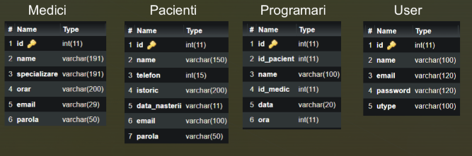

# 🏥 Medical Office Management System
## Overview
This system allows a medical office to store and manage patient data. It provides functionalities for managers, doctors, and patients to interact with patient and appointment information. The system includes user roles for management, doctor, and patient access with secure authentication and authorization. 🔐

## Features
### Manager 👨‍💼:

View, add, or remove patients and doctors. 🔎 ➕ ➖

Modify or delete appointments. 🗓️ ❌

Create and manage patient/doctor accounts. 👩‍⚕️ 👨‍⚕️

### Doctor 👩‍⚕️:

Add, edit, or delete patients and appointments. ✏️ ❌

View patient details such as medical history and contact information. 📝 📞

### Patient 🧑‍⚕️:

Add or delete appointments. 📅 ➕ ❌
## Architecture
User Interface 🖥️: Separate interfaces for manager, doctor, and patient roles.

Application Logic 💻: Manages patient, doctor, and appointment data, handles user authentication.
## Database 🗃️:
MySQL: Stores data on patients, doctors, users, and appointments with proper relationships. 🔗

Database Connection 🌐: Allows the application to interact with MySQL for data operations.
## Technologies Used:
Frontend: JavaFX  🖼️

Backend: Java (developed using NetBeans IDE) ☕

Database: MySQL 🗄️

Setup
Clone the repository:

git clone https://github.com/username/repository.git

Open the project in NetBeans. 📂

Set up the MySQL database using the provided schema. 🗂️

Configure the database connection in your project settings. 🌐

Run the project from NetBeans to start the application. 🚀

